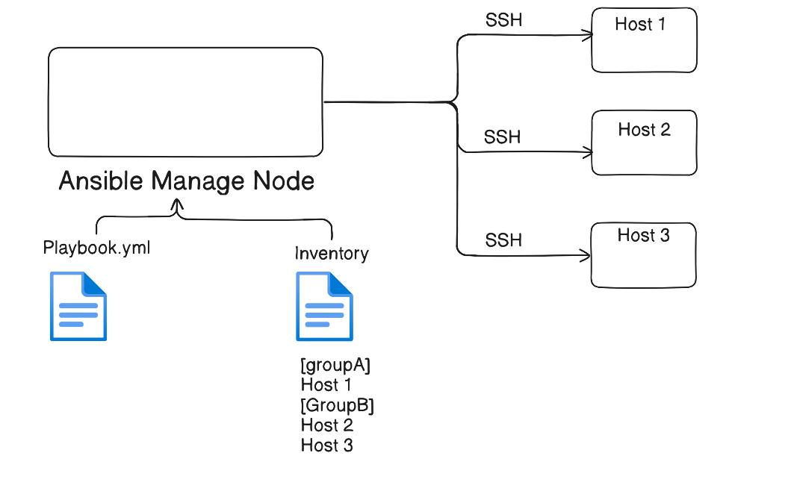

# 📘 Installation of an Ansible

Welcome to the **Installation** section of this repository.  
This guide will help you understand how we can Install and Setup ansible on server.

## Ansible Architecture


#### Note - To make communication enable between the Ansible Master/Control Node and Ansible Manage Nodes, a few key requirements must be in place:
- SSH Connectivity enable (Port 22) on Manage Nodes
- SSH Key-based / Passwordless authentication
- Python Installed on Manage Nodes
- Inventory File Configuration ```/etc/ansible/hosts```

## How Ansible Works
### Ansible run tasks in the following manner - 

1. First, Ansible Master Gather Facts means it connects to the target systems (over SSH for Linux/Unix OR WinRM for Windows).
2. Then, it sends commands to the system to perform tasks like installing software, modifying files or Starting/Stopping services.
3. Finally, Ansible returns the output of those tasks and reports Success or Failure.

## How to setup Ansible
Follow below steps to install Ansible

### Install Ansible on Ubuntu/Debian
```bash
# update the server
sudo apt update

# Add ansible repository for installation (It contains latest stable version of an Ansible)
sudo apt-add-repository ppa:ansible/ansible

sudo apt install ansible -y

# update the server
sudo apt update

# To verify ansible installation
ansible --version
```

### Install Ansible on RHEL/CentOS

```bash
# Update the server
sudo yum update -y

# Install Ansible by enabling the EPEL repository
sudo yum install epel-release -y
sudo yum install ansible -y

# To verify ansible installation
ansible --version
```

After updated inventory file on Node/Server
#### Command to check inventory configuation
```ansible-inventory --list```

#### Test Connectivity
```ansible -m ping servers```